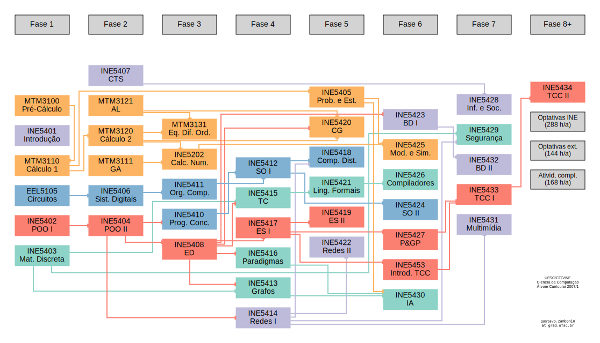

# Gerador de Grafo de Currículo

Este projeto combina um gerador de grafos de currículo em Python com uma interface web desenvolvida em Next.js. Ele processa dados em JSON para criar grafos direcionados que representam dependências entre disciplinas e fases, e exibe esses grafos em uma interface web.

---

## Funcionalidades

### Backend (Python)
- Gera grafos de currículo com layouts personalizados.
- Suporta cabeçalhos, colunas e conexões entre disciplinas.
- Exporta grafos no formato `.dot`, que podem ser convertidos para `.svg` ou outros formatos usando o Graphviz.

### Frontend (Next.js)
- Interface web para visualizar os grafos gerados.
- Suporte a fontes otimizadas e design responsivo.
- Exibe o gráfico em formato SVG diretamente na página.

---

## Requisitos

### Backend
- Python 3.9 ou superior
- Graphviz instalado no sistema

### Frontend
- Node.js 16 ou superior
- Gerenciador de pacotes (npm, yarn, pnpm ou bun)

---

## Instalação

### Backend (Python)
1. Clone o repositório:
   ```bash
   git clone https://github.com/seuusuario/curriculum_graph_generator.git
   cd curriculum_graph_generator
   ```

2. Instale as dependências do Python:
   ```bash
   pip install -r graph-gen/requirements.txt
   ```

3. Instale o pacote do Graphviz:
   - **macOS**:
     ```bash
     brew install graphviz
     ```
   - **Ubuntu/Debian**:
     ```bash
     sudo apt-get install graphviz
     ```
   - **Windows**:
     Baixe e instale a partir do [site oficial do Graphviz](https://graphviz.gitlab.io/download/).

---

### Frontend (Next.js)
1. Navegue até o diretório do frontend:
   ```bash
   cd curriculum-graph-gen
   ```

2. Instale as dependências do projeto:
   ```bash
   npm install
   ```

3. Inicie o servidor de desenvolvimento:
   ```bash
   npm run dev
   ```

4. Abra [http://localhost:3000](http://localhost:3000) no navegador para visualizar a interface.

---

## Uso

### Backend
1. Coloque o arquivo JSON do currículo no diretório apropriado:
   ```
   curriculos/ciencias_da_computação/curriculo_208_20242.json
   ```

2. Execute o script para gerar o arquivo `.dot`:
   ```bash
   python graph-gen/graph_gen.py
   ```

3. Converta o arquivo `.dot` para `.svg`:
   ```bash
   dot -Tsvg -o graph.svg figure1.dot
   ```

### Frontend
1. Certifique-se de que o arquivo `graph.svg` gerado pelo backend está na pasta pública do frontend:
   ```
   curriculum-graph-gen/public/graph.svg
   ```

2. Acesse a interface web para visualizar o gráfico.

---

## Estrutura de Arquivos

### Backend
- **graph-gen/graph_gen.py**: Script principal para gerar os grafos.
- **graph-gen/requirements.txt**: Dependências do Python.
- **curriculos/**: Diretório contendo os arquivos JSON do currículo.

### Frontend
- **curriculum-graph-gen/src/app/page.tsx**: Página principal que exibe o gráfico.
- **curriculum-graph-gen/src/app/globals.css**: Estilos globais do projeto.
- **curriculum-graph-gen/next.config.ts**: Configuração do Next.js.
- **curriculum-graph-gen/public/**: Diretório para arquivos públicos, como o `graph.svg`.

---

## Exemplo de Saída

### Backend
O grafo gerado terá a seguinte aparência:



### Frontend
A interface web exibirá o gráfico gerado diretamente no navegador.

---